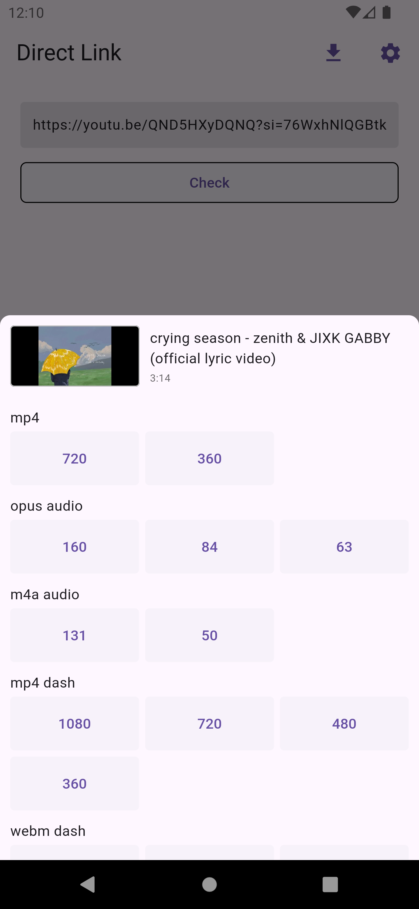

# direct_link

[](https://pub.dev/packages/direct_link)
[](https://github.com/thitlwincoder/direct_link/commits/master)
[](https://github.com/thitlwincoder/direct_link)
[](https://github.com/thitlwincoder/direct_link/blob/master/LICENSE)
<br>
[](https://github.com/thitlwincoder)

For those who want to create a movie and downloader app, this is a useful package.

You can get a direct link from the URL that my support sites.

## Support Websites

- Facebook
- Instagram
- Youtube
- Twitter
- Dailymotion
- Vimeo
- VK
- SoundCloud
- Tiktok
- Reddit
- Threads

## Screenshot




## Getting Started

In the `pubspec.yaml` of your flutter project, add the following dependency:

```yaml
dependencies:
  ...
  direct_link: latest
```

In your library add the following import:

```dart
import 'package:direct_link/direct_link.dart';
```

## Usage

```dart
var directLink = DirectLink();
```

Initialize the plugin for notification

```dart
directLink.init(
  allowNotification: true,
  androidInitializationSettings:
    const AndroidInitializationSettings('launch_background'), // add your logo
);
```


Use `check` function to check your link have been existed my support sites

```dart
var data = await directLink.check('url'); // add your url
```

### Example

```dart
if (data != null) {
  print(data.title);
  print(data.thumbnail);
  print(data.duration);
  for (var e in data.links!) {
    print(e.type);
    print(e.quality);
    print(e.link);
    print('-' * 20);
  }
}
```

If you want to download use `download` function.

```dart
await directLink.download(
  url: data.links[0].link, // use link from data.links
  savedDir: dir,
  fileName: fileName,
);
```

## Contribution

Feel free to file an [issue](https://github.com/thitlwincoder/direct_link/issues/new) if you find a problem or make pull requests.

All contributions are welcome :)
